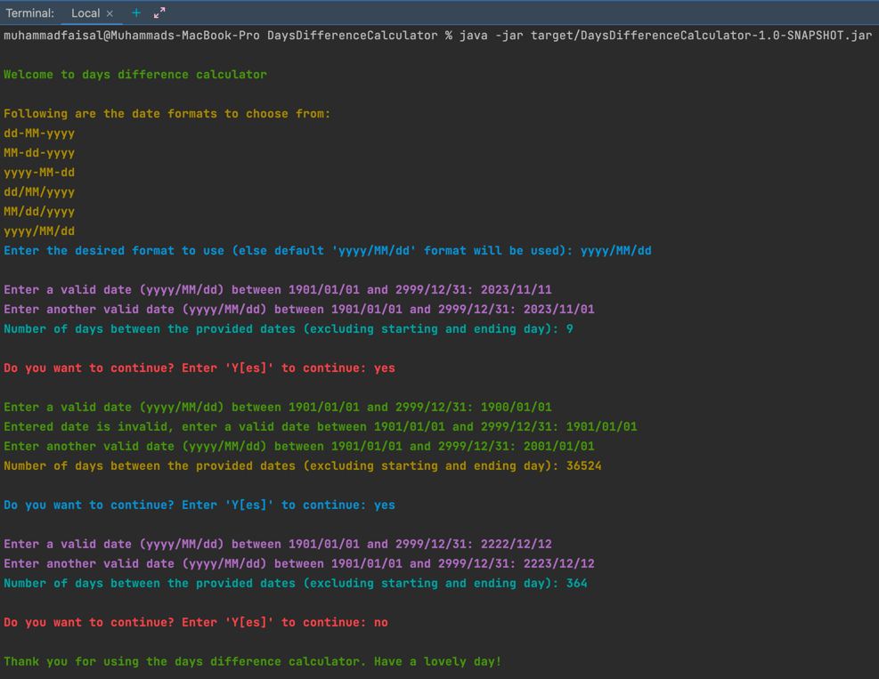

# DaysDifferenceCalculator

## Date Calculator: Problem Description

Command line application (built using **JAVA 20**) for calculating the number of full days elapsed between start and end dates. 

The first and last days are considered partial days and are never counted. 

Following this logic, an experiment that has run from `1972-11-07` to `1972-11-08` should return `0`, 
because there are no fully elapsed days contained in between those dates. 

And `2000-01-01` to `2000-01-03` should return `1`. 

The solution needs to cater to all valid dates between `1901-01-01` and `2999-12-31`.

This is a command line based system with at least one way of providing input and output on the terminal. 

**No libraries** should be used to build this solution. 

Although any dates specified within the valid date range listed above should work, 
here are a few test cases to validate the output of your program.

#### TEST CASES

```
1. 1983-06-02 – 1983-06-22: 19 days
2. 1984-07-04 – 1984-12-25: 173 days
3. 1989-01-03 – 1983-08-03: 1979 days
```

#### Steps to test:

1. Java 8 and maven should be installed on the system
2. Download the project code
3. Navigate to the project folder/directory
4. Package/generate the jar file by executing `mvn clean package` command from terminal
5. Then execute `java -jar target/DaysDifferenceCalculator-1.0-SNAPSHOT.jar` command from terminal to see it in action :)
6. In order to use this code with some IDE, 
   * `mvn idea:idea` command can be executed for Intellij, 
   * `mvn eclipse:eclpise` command can be executed for Eclipse.

#### Application's Demo

